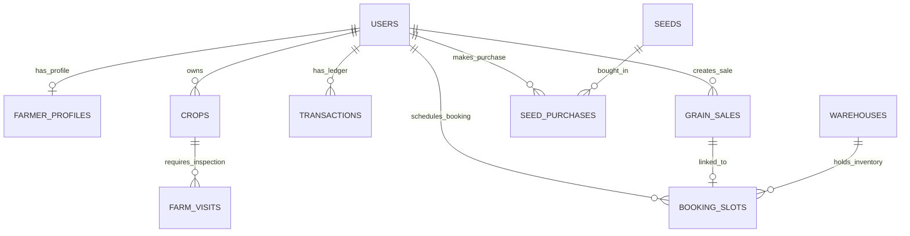
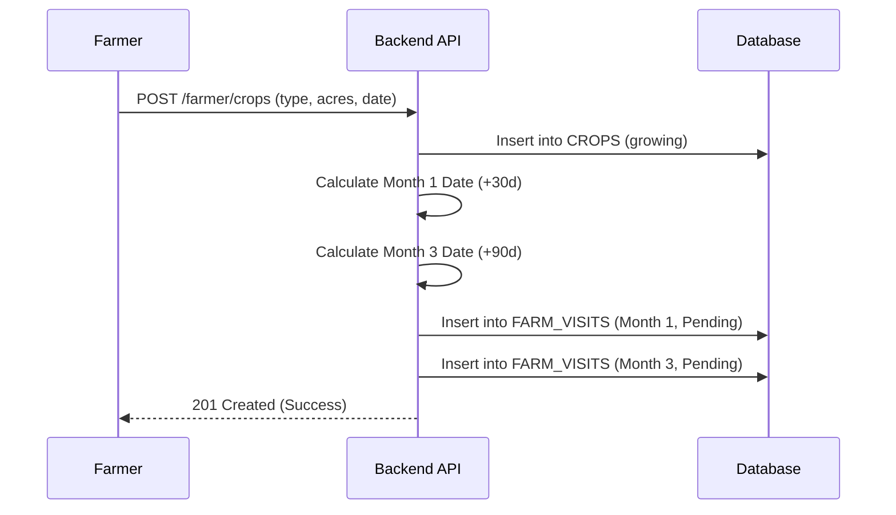

# Backend Engineering Specification
**Project:** AgriFlow ERP (AgroSeq)
**Document Version:** 5.0

---

## 1. Complete Module Inventory

| Module | Sub-Module/Screen | Route | Purpose | Roles |
|--------|-------------------|-------|---------|-------|
| **Public** | Landing Page | `/` | System overview | Public |
| | Market Rates | `/market-rates` | Live grain prices | Public |
| | Seeds Catalog | `/seeds-catalog` | View seed inventory | Public |
| **Auth** | Farmer Register | `/register` | New farmer onboarding | Public |
| | Farmer Login | `/login` | Farmer auth | Public |
| | Manager Login | `/manager` | Manager auth | Public |
| | Admin Login | `/admin` | Super Admin auth | Public |
| | Forgot Password | `/forgot-password` | Account recovery | Public |
| **Farmer** | Dashboard | `/farmer/dashboard` | KPI and summary view | Farmer |
| | Crop Management | `/farmer/crops` | Manage crop cycles | Farmer |
| | Seed Purchase | `/farmer/seeds` | Buy seeds | Farmer |
| | Grain Sales | `/farmer/grain-sales` | Sell harvested grains | Farmer |
| | Booking Slots | `/farmer/booking-slots`| Schedule delivery | Farmer |
| | Transactions | `/farmer/transactions`| View ledger | Farmer |
| | Profile | `/farmer/profile` | Manage bank/docs | Farmer |
| **Manager**| Dashboard | `/manager/dashboard` | Regional analytics | Manager |
| | Farmers Directory | `/manager/dashboard/farmers`| View assigned farmers | Manager |
| | Farm Visits | `/manager/dashboard/visits` | Conduct crop inspections | Manager |
| | Grain Sales | `/manager/dashboard/grain-sales`| Initial approval of grain | Manager |
| | Bookings | `/manager/dashboard/booking-slots`| Warehouse management | Manager |
| **Admin**  | Dashboard | `/admin/dashboard` | Global analytics | Admin |
| | Farmers Directory | `/admin/dashboard/farmers`| Approve/view all farmers | Admin |
| | Farm Visits | `/admin/dashboard/visits` | Global visit oversight | Admin |
| | Grain Sales | `/admin/dashboard/grain-sales`| Final approval & pricing | Admin |
| | Bookings | `/admin/dashboard/booking-slots`| Global warehouse tracking | Admin |
| | Market Rates | `/admin/dashboard/market-rates`| Set daily pricing | Admin |
| | Seed Inventory | `/admin/dashboard/seeds` | Manage seed stock | Admin |
| | Bank Requests | `/admin/dashboard/bank-requests` | Approve bank changes | Admin |

---

## 2. Detailed Screen Specifications

### Screen: Landing Page
* **Screen/Page Name:** Landing Page
* **Route/URL:** /
* **Purpose of the Screen:** Marketing overview and public stats.
* **User Roles with Access:** Public
* **Components Used:** Hero, Features, Footer
* **Forms Present:** None
* **Fields and Data Types:** None
* **Required vs Optional Fields:** 
  * **Required:** None
  * **Optional:** None
* **Validation Rules:** None
* **Table/Grid Columns:** None
* **Filters and Search Criteria:** None
* **Actions Available:** Navigate to Login/Register, View Market Rates
* **Expected API Endpoints:** GET /api/public/stats (optional)
* **Request Payloads:** None
* **Response Payloads:** { "active_farmers": 100, "grains_procured": 5000 }
* **Business Rules:** Data must be cached to prevent DB overload.
* **State Transitions:** N/A
* **Error Handling Requirements:** Standard 400/500

### Screen: Market Rates (Public)
* **Screen/Page Name:** Market Rates (Public)
* **Route/URL:** /market-rates
* **Purpose of the Screen:** View live crop prices by grade.
* **User Roles with Access:** Public
* **Components Used:** RateCard, DataTable
* **Forms Present:** None
* **Fields and Data Types:** None
* **Required vs Optional Fields:** 
  * **Required:** None
  * **Optional:** None
* **Validation Rules:** None
* **Table/Grid Columns:** Crop, Grade, Price/Kg, Effective Date
* **Filters and Search Criteria:** Search by Crop Name
* **Actions Available:** View Rates
* **Expected API Endpoints:** GET /api/public/market-rates
* **Request Payloads:** None
* **Response Payloads:** [{ "crop_type": "Rice", "grade": "A", "price_per_kg": 30.50 }]
* **Business Rules:** Rates reflect the latest effective date entered by Super Admin.
* **State Transitions:** N/A
* **Error Handling Requirements:** Standard 400/500

### Screen: Seeds Catalog (Public)
* **Screen/Page Name:** Seeds Catalog (Public)
* **Route/URL:** /seeds-catalog
* **Purpose of the Screen:** View available seed inventory.
* **User Roles with Access:** Public
* **Components Used:** SeedCard, CatalogGrid
* **Forms Present:** None
* **Fields and Data Types:** None
* **Required vs Optional Fields:** 
  * **Required:** None
  * **Optional:** None
* **Validation Rules:** None
* **Table/Grid Columns:** None
* **Filters and Search Criteria:** Search by Seed Name or Variety
* **Actions Available:** View Inventory
* **Expected API Endpoints:** GET /api/public/seeds
* **Request Payloads:** None
* **Response Payloads:** [{ "name": "Rice Seeds", "price_per_kg": 50, "stock_kg": 1000 }]
* **Business Rules:** Only displays seeds with stock_kg > 0.
* **State Transitions:** N/A
* **Error Handling Requirements:** Standard 400/500

### Screen: Farmer Register
* **Screen/Page Name:** Farmer Register
* **Route/URL:** /register
* **Purpose of the Screen:** Onboard new farmers.
* **User Roles with Access:** Public
* **Components Used:** MultiStepForm, OTPInput
* **Forms Present:** Registration Form
* **Fields and Data Types:** phone (String), otp (String), name (String), password (String)
* **Required vs Optional Fields:** 
  * **Required:** phone, otp, name, password
  * **Optional:** None
* **Validation Rules:** Phone must be 10 digits. Password min 8 chars. OTP exactly 6 digits.
* **Table/Grid Columns:** None
* **Filters and Search Criteria:** None
* **Actions Available:** Send OTP, Verify OTP, Register
* **Expected API Endpoints:** POST /api/auth/send-otp, POST /api/auth/verify-otp, POST /api/auth/register
* **Request Payloads:** { "phone": "...", "otp_token": "...", "name": "...", "password": "..." }
* **Response Payloads:** { "token": "jwt", "user": { "id": 1, "status": "pending" } }
* **Business Rules:** Creates pending farmer. Cannot access system until Admin approves.
* **State Transitions:** N/A
* **Error Handling Requirements:** Standard 400/500

### Screen: Farmer Login
* **Screen/Page Name:** Farmer Login
* **Route/URL:** /login
* **Purpose of the Screen:** Authenticate farmer.
* **User Roles with Access:** Public
* **Components Used:** LoginForm
* **Forms Present:** Login Form
* **Fields and Data Types:** phone (String), password (String)
* **Required vs Optional Fields:** 
  * **Required:** phone, password
  * **Optional:** None
* **Validation Rules:** Standard authentication checks.
* **Table/Grid Columns:** None
* **Filters and Search Criteria:** None
* **Actions Available:** Login
* **Expected API Endpoints:** POST /api/auth/login
* **Request Payloads:** { "phone": "...", "password": "...", "role": "farmer" }
* **Response Payloads:** { "token": "jwt", "user": { "id": 1, "status": "active" } }
* **Business Rules:** Generates JWT token valid for 24 hours.
* **State Transitions:** N/A
* **Error Handling Requirements:** 401 Unauthorized for invalid credentials.

### Screen: Manager Login
* **Screen/Page Name:** Manager Login
* **Route/URL:** /manager
* **Purpose of the Screen:** Authenticate regional manager.
* **User Roles with Access:** Public
* **Components Used:** LoginForm
* **Forms Present:** Login Form
* **Fields and Data Types:** phone (String), password (String)
* **Required vs Optional Fields:** 
  * **Required:** phone, password
  * **Optional:** None
* **Validation Rules:** Requires manager role.
* **Table/Grid Columns:** None
* **Filters and Search Criteria:** None
* **Actions Available:** Login
* **Expected API Endpoints:** POST /api/auth/login
* **Request Payloads:** { "phone": "...", "password": "...", "role": "manager" }
* **Response Payloads:** { "token": "jwt", "user": { "id": 2, "role": "manager" } }
* **Business Rules:** Only permits users with 'manager' role.
* **State Transitions:** N/A
* **Error Handling Requirements:** Standard 400/500

### Screen: Admin Login
* **Screen/Page Name:** Admin Login
* **Route/URL:** /admin
* **Purpose of the Screen:** Authenticate super admin.
* **User Roles with Access:** Public
* **Components Used:** LoginForm
* **Forms Present:** Login Form
* **Fields and Data Types:** phone (String), password (String)
* **Required vs Optional Fields:** 
  * **Required:** phone, password
  * **Optional:** None
* **Validation Rules:** Requires super_admin role.
* **Table/Grid Columns:** None
* **Filters and Search Criteria:** None
* **Actions Available:** Login
* **Expected API Endpoints:** POST /api/auth/login
* **Request Payloads:** { "phone": "...", "password": "...", "role": "super_admin" }
* **Response Payloads:** { "token": "jwt", "user": { "id": 3, "role": "super_admin" } }
* **Business Rules:** Only permits users with 'super_admin' role.
* **State Transitions:** N/A
* **Error Handling Requirements:** Standard 400/500

### Screen: Farmer Dashboard
* **Screen/Page Name:** Farmer Dashboard
* **Route/URL:** /farmer/dashboard
* **Purpose of the Screen:** High-level summary of farmer operations.
* **User Roles with Access:** Farmer (Active)
* **Components Used:** StatCard, CropCycleExplainer, SectionCard
* **Forms Present:** None
* **Fields and Data Types:** None
* **Required vs Optional Fields:** 
  * **Required:** None
  * **Optional:** None
* **Validation Rules:** None
* **Table/Grid Columns:** None
* **Filters and Search Criteria:** None
* **Actions Available:** Navigate to specific modules
* **Expected API Endpoints:** GET /api/farmer/dashboard
* **Request Payloads:** None
* **Response Payloads:** { "crops": 2, "totalEarned": 150000, "visits": [...] }
* **Business Rules:** Must aggregate only the authenticated user's data.
* **State Transitions:** N/A
* **Error Handling Requirements:** 403 Forbidden if status is pending.

### Screen: Crop Management (Farmer)
* **Screen/Page Name:** Crop Management (Farmer)
* **Route/URL:** /farmer/crops
* **Purpose of the Screen:** Register and track crop cycles.
* **User Roles with Access:** Farmer (Active)
* **Components Used:** CropCard, Modal, CropCycleTracker
* **Forms Present:** Add Crop Form
* **Fields and Data Types:** crop_type (Enum), acres (Decimal), sowing_date (Date)
* **Required vs Optional Fields:** 
  * **Required:** crop_type, acres, sowing_date
  * **Optional:** notes (String)
* **Validation Rules:** Acres > 0. Sowing Date <= Today.
* **Table/Grid Columns:** Grid: Crop Type, Acres, Sowing Date, Status
* **Filters and Search Criteria:** None
* **Actions Available:** Create Crop
* **Expected API Endpoints:** GET /api/farmer/crops, POST /api/farmer/crops
* **Request Payloads:** { "crop_type": "Rice", "acres": 4.5, "sowing_date": "2024-04-10" }
* **Response Payloads:** { "id": 1, "status": "growing", "message": "Created" }
* **Business Rules:** Adding a crop auto-schedules Month 1 and Month 3 Farm Visits.
* **State Transitions:** growing -> harvested
* **Error Handling Requirements:** Standard 400/500

### Screen: Seed Purchase (Farmer)
* **Screen/Page Name:** Seed Purchase (Farmer)
* **Route/URL:** /farmer/seeds
* **Purpose of the Screen:** Purchase seeds from admin inventory.
* **User Roles with Access:** Farmer (Active)
* **Components Used:** SeedCard, Modal, DataTable
* **Forms Present:** Purchase Form
* **Fields and Data Types:** quantity_kg (Decimal), upi_id (String), transaction_id (String)
* **Required vs Optional Fields:** 
  * **Required:** quantity_kg, upi_id, transaction_id
  * **Optional:** None
* **Validation Rules:** Quantity > 0 and <= available stock.
* **Table/Grid Columns:** Seed, Quantity, Price/kg, Total, UPI, Txn ID, Status
* **Filters and Search Criteria:** Text search by seed name. Tab filter (Browse / History).
* **Actions Available:** Create Purchase
* **Expected API Endpoints:** GET /api/farmer/seeds, GET /api/farmer/seed-purchases, POST /api/farmer/seed-purchase
* **Request Payloads:** { "seed_id": 1, "quantity_kg": 10, "upi_id": "test@upi", "transaction_id": "123" }
* **Response Payloads:** { "invoice_number": "INV-123", "total_amount": 500 }
* **Business Rules:** Deducts stock instantly. Creates debit transaction record.
* **State Transitions:** N/A
* **Error Handling Requirements:** Standard 400/500

### Screen: Grain Sales (Farmer)
* **Screen/Page Name:** Grain Sales (Farmer)
* **Route/URL:** /farmer/grain-sales
* **Purpose of the Screen:** Submit harvest for procurement.
* **User Roles with Access:** Farmer (Active)
* **Components Used:** DataTable, Modal, RateCard
* **Forms Present:** Submit Sale Form
* **Fields and Data Types:** grain_type (Enum), grade (Enum), crop_id (Int), raw_material_kg (Decimal), wastage_kg (Decimal), good_material_kg (Decimal)
* **Required vs Optional Fields:** 
  * **Required:** grain_type, grade, good_material_kg
  * **Optional:** crop_id, raw_material_kg, wastage_kg
* **Validation Rules:** Good material > 0.
* **Table/Grid Columns:** Grain, Grade, Raw, Wastage, Good, Rate/kg, Amount, Status, Date
* **Filters and Search Criteria:** None
* **Actions Available:** Create Sale Request
* **Expected API Endpoints:** GET /api/farmer/grain-sales, POST /api/farmer/grain-sale, GET /api/farmer/market-rates
* **Request Payloads:** { "grain_type": "Rice", "grade": "A", "good_material_kg": 500 }
* **Response Payloads:** { "estimated_amount": 15000, "status": "pending" }
* **Business Rules:** Amount calculated using active Market Rates. Status defaults to pending.
* **State Transitions:** pending -> approved -> paid (OR rejected)
* **Error Handling Requirements:** Standard 400/500

### Screen: Booking Slots (Farmer)
* **Screen/Page Name:** Booking Slots (Farmer)
* **Route/URL:** /farmer/booking-slots
* **Purpose of the Screen:** Schedule delivery to warehouses.
* **User Roles with Access:** Farmer (Active)
* **Components Used:** DataTable, Modal, WarehouseCard
* **Forms Present:** Book Slot Form
* **Fields and Data Types:** warehouse_id (Int), grain_sale_id (Int), booking_date (Date), quantity_kg (Decimal), delivery_address (String)
* **Required vs Optional Fields:** 
  * **Required:** warehouse_id, booking_date, quantity_kg, delivery_address
  * **Optional:** grain_sale_id
* **Validation Rules:** Quantity <= Warehouse Available Capacity.
* **Table/Grid Columns:** Date, Grain, Quantity, Warehouse, Delivery Address, Status
* **Filters and Search Criteria:** None
* **Actions Available:** Create Booking
* **Expected API Endpoints:** GET /api/farmer/booking-slots, POST /api/farmer/booking-slot, GET /api/farmer/warehouses
* **Request Payloads:** { "warehouse_id": 1, "quantity_kg": 1000, "booking_date": "2024-05-10", ... }
* **Response Payloads:** { "id": 1, "status": "pending" }
* **Business Rules:** Must validate available capacity before accepting.
* **State Transitions:** pending -> confirmed -> completed
* **Error Handling Requirements:** Standard 400/500

### Screen: Transaction History (Farmer)
* **Screen/Page Name:** Transaction History (Farmer)
* **Route/URL:** /farmer/transactions
* **Purpose of the Screen:** Financial ledger.
* **User Roles with Access:** Farmer (Active)
* **Components Used:** DataTable
* **Forms Present:** None
* **Fields and Data Types:** None
* **Required vs Optional Fields:** 
  * **Required:** None
  * **Optional:** None
* **Validation Rules:** None
* **Table/Grid Columns:** Date, Type, Description, UPI ID, Txn ID, Invoice, Amount, Status
* **Filters and Search Criteria:** Type (Credit/Debit), Text Search, Date Range
* **Actions Available:** Export CSV
* **Expected API Endpoints:** GET /api/farmer/transactions
* **Request Payloads:** None
* **Response Payloads:** [{ "direction": "credit", "amount": 15000, "status": "completed" }]
* **Business Rules:** Read-only view generated by system actions.
* **State Transitions:** N/A
* **Error Handling Requirements:** Standard 400/500

### Screen: Profile (Farmer)
* **Screen/Page Name:** Profile (Farmer)
* **Route/URL:** /farmer/profile
* **Purpose of the Screen:** Manage personal, farm, bank details.
* **User Roles with Access:** Farmer
* **Components Used:** ProfileCard, UploadForm
* **Forms Present:** Personal Form, Agri Form, Bank Form
* **Fields and Data Types:** address, crop_address, acres_of_land, soil_type, irrigation_type, bank_name, account_number, ifsc_code, upi_id, doc_urls
* **Required vs Optional Fields:** 
  * **Required:** name, phone
  * **Optional:** All other fields
* **Validation Rules:** IFSC standard format. Acct Number numeric.
* **Table/Grid Columns:** None
* **Filters and Search Criteria:** None
* **Actions Available:** Update Personal, Update Agri, Request Bank Change, Upload Docs
* **Expected API Endpoints:** GET /api/farmer/profile, PATCH /api/farmer/profile, POST /api/farmer/bank-change-request
* **Request Payloads:** { "acres_of_land": 10.5 }
* **Response Payloads:** { "message": "Updated successfully" }
* **Business Rules:** Direct bank edits disabled; creates a bank change request requiring Admin approval.
* **State Transitions:** N/A
* **Error Handling Requirements:** Standard 400/500

### Screen: Admin Dashboard
* **Screen/Page Name:** Admin Dashboard
* **Route/URL:** /admin/dashboard
* **Purpose of the Screen:** System-wide analytics.
* **User Roles with Access:** Manager, Admin
* **Components Used:** Charts (AreaChart), StatCards
* **Forms Present:** None
* **Fields and Data Types:** None
* **Required vs Optional Fields:** 
  * **Required:** None
  * **Optional:** None
* **Validation Rules:** None
* **Table/Grid Columns:** Recent Transactions snippet
* **Filters and Search Criteria:** Date Range (MTD, YTD)
* **Actions Available:** View Reports
* **Expected API Endpoints:** GET /api/admin/dashboard
* **Request Payloads:** None
* **Response Payloads:** { "totalFarmers": 500, "revenueMTD": 100000, "monthlySales": [...] }
* **Business Rules:** Aggregates entire system data. Managers may see localized stats.
* **State Transitions:** N/A
* **Error Handling Requirements:** Standard 400/500

### Screen: Farmers Directory (Admin/Manager)
* **Screen/Page Name:** Farmers Directory (Admin/Manager)
* **Route/URL:** /*/dashboard/farmers
* **Purpose of the Screen:** Review and approve/reject farmers.
* **User Roles with Access:** Manager, Admin
* **Components Used:** DataTable, DetailPanel
* **Forms Present:** None
* **Fields and Data Types:** status (Enum)
* **Required vs Optional Fields:** 
  * **Required:** status
  * **Optional:** None
* **Validation Rules:** Status in [active, rejected]
* **Table/Grid Columns:** Farmer, Phone, Address, Acres, Status, Registered Date
* **Filters and Search Criteria:** Status Tabs, Text Search
* **Actions Available:** Approve, Reject, View Details
* **Expected API Endpoints:** GET /api/admin/farmers, GET /api/admin/farmers/:id, PATCH /api/admin/farmers/:id/approve
* **Request Payloads:** { "status": "active" }
* **Response Payloads:** { "message": "Farmer updated" }
* **Business Rules:** Approving a farmer grants them full system access.
* **State Transitions:** N/A
* **Error Handling Requirements:** Standard 400/500

### Screen: Farm Visits (Admin/Manager)
* **Screen/Page Name:** Farm Visits (Admin/Manager)
* **Route/URL:** /*/dashboard/visits
* **Purpose of the Screen:** Schedule and log farm inspections.
* **User Roles with Access:** Manager, Admin
* **Components Used:** DataTable, Modal
* **Forms Present:** Schedule Visit Form, Log Visit Report Form
* **Fields and Data Types:** scheduled_date (Date), actual_date (Date), report_notes (Text), status (Enum)
* **Required vs Optional Fields:** 
  * **Required:** scheduled_date, status
  * **Optional:** actual_date, report_notes
* **Validation Rules:** Status must be pending or completed.
* **Table/Grid Columns:** Farmer, Crop, Month, Scheduled Date, Actual Date, Status
* **Filters and Search Criteria:** Status (Pending/Completed), Date Range
* **Actions Available:** Schedule Visit, Mark Completed, Edit Report
* **Expected API Endpoints:** GET /api/admin/visits, PATCH /api/admin/visits/:id
* **Request Payloads:** { "actual_date": "2024-05-15", "status": "completed", "report_notes": "Crop looks healthy" }
* **Response Payloads:** { "message": "Visit updated" }
* **Business Rules:** Month 1 and Month 3 are auto-generated but can be rescheduled.
* **State Transitions:** N/A
* **Error Handling Requirements:** Standard 400/500

### Screen: Grain Sales Approval (Admin/Manager)
* **Screen/Page Name:** Grain Sales Approval (Admin/Manager)
* **Route/URL:** /*/dashboard/grain-sales
* **Purpose of the Screen:** Review procurement requests.
* **User Roles with Access:** Manager, Admin
* **Components Used:** DataTable, ApprovalModal
* **Forms Present:** Approval Form
* **Fields and Data Types:** final_grade (Enum), final_good_material_kg (Decimal), final_price_per_kg (Decimal), status (Enum)
* **Required vs Optional Fields:** 
  * **Required:** status
  * **Optional:** final_grade, final_good_material_kg, final_price_per_kg
* **Validation Rules:** Price > 0 if approved.
* **Table/Grid Columns:** Farmer, Grain, Grade, Req Qty, Apprv Qty, Rate, Amount, Status
* **Filters and Search Criteria:** Status (Pending, Approved, Paid, Rejected), Grain Type
* **Actions Available:** Approve, Reject, Adjust Qty/Rate
* **Expected API Endpoints:** GET /api/admin/grain-sales, PATCH /api/admin/grain-sales/:id
* **Request Payloads:** { "status": "approved", "final_good_material_kg": 490 }
* **Response Payloads:** { "message": "Sale approved" }
* **Business Rules:** Approving triggers creation of a pending credit in the Transactions table.
* **State Transitions:** pending -> approved -> paid
* **Error Handling Requirements:** Standard 400/500

### Screen: Booking Slots Approval (Admin/Manager)
* **Screen/Page Name:** Booking Slots Approval (Admin/Manager)
* **Route/URL:** /*/dashboard/booking-slots
* **Purpose of the Screen:** Manage warehouse deliveries.
* **User Roles with Access:** Manager, Admin
* **Components Used:** DataTable, ActionButtons
* **Forms Present:** None
* **Fields and Data Types:** status (Enum)
* **Required vs Optional Fields:** 
  * **Required:** status
  * **Optional:** None
* **Validation Rules:** None
* **Table/Grid Columns:** Date, Farmer, Grain, Quantity, Warehouse, Delivery Address, Status
* **Filters and Search Criteria:** Status, Warehouse
* **Actions Available:** Confirm Slot, Complete Delivery, Cancel
* **Expected API Endpoints:** GET /api/admin/booking-slots, PATCH /api/admin/booking-slots/:id
* **Request Payloads:** { "status": "confirmed" }
* **Response Payloads:** { "message": "Booking confirmed" }
* **Business Rules:** Confirming reserves capacity. Completing updates warehouse `current_load_kg`.
* **State Transitions:** N/A
* **Error Handling Requirements:** Standard 400/500

### Screen: Market Rates Management (Admin)
* **Screen/Page Name:** Market Rates Management (Admin)
* **Route/URL:** /admin/dashboard/market-rates
* **Purpose of the Screen:** Set daily crop pricing.
* **User Roles with Access:** Admin
* **Components Used:** DataTable, Modal
* **Forms Present:** Add/Edit Rate Form
* **Fields and Data Types:** crop_type (Enum), grade (Enum), price_per_kg (Decimal), effective_date (Date)
* **Required vs Optional Fields:** 
  * **Required:** All fields required.
  * **Optional:** None
* **Validation Rules:** Price > 0.
* **Table/Grid Columns:** Crop, Grade, Price/Kg, Effective Date, Added By
* **Filters and Search Criteria:** Crop Type
* **Actions Available:** Add Rate, Update Rate, Delete Rate
* **Expected API Endpoints:** GET /api/admin/market-rates, POST /api/admin/market-rates, PUT /api/admin/market-rates/:id
* **Request Payloads:** { "crop_type": "Rice", "grade": "A", "price_per_kg": 32.50, "effective_date": "2024-05-01" }
* **Response Payloads:** { "message": "Rate updated" }
* **Business Rules:** Rates dictate the estimated amounts in Farmer Grain Sales.
* **State Transitions:** N/A
* **Error Handling Requirements:** Standard 400/500

### Screen: Seed Inventory Management (Admin)
* **Screen/Page Name:** Seed Inventory Management (Admin)
* **Route/URL:** /admin/dashboard/seeds
* **Purpose of the Screen:** Manage seed products and stock levels.
* **User Roles with Access:** Admin
* **Components Used:** DataTable, Modal
* **Forms Present:** Add/Edit Seed Form
* **Fields and Data Types:** name (String), variety (String), price_per_kg (Decimal), stock_kg (Decimal), description (String)
* **Required vs Optional Fields:** 
  * **Required:** name, price_per_kg, stock_kg
  * **Optional:** variety, description
* **Validation Rules:** Price > 0, Stock >= 0.
* **Table/Grid Columns:** Name, Variety, Price, Stock, Actions
* **Filters and Search Criteria:** Search by Name
* **Actions Available:** Add Seed, Update Seed, Delete Seed
* **Expected API Endpoints:** GET /api/admin/seeds, POST /api/admin/seeds, PUT /api/admin/seeds/:id
* **Request Payloads:** { "name": "Rice Seeds", "price_per_kg": 45, "stock_kg": 2000 }
* **Response Payloads:** { "message": "Seed inventory updated" }
* **Business Rules:** Stock is deducted automatically when farmers purchase seeds.
* **State Transitions:** N/A
* **Error Handling Requirements:** Standard 400/500

### Screen: Bank Requests Approval (Admin)
* **Screen/Page Name:** Bank Requests Approval (Admin)
* **Route/URL:** /admin/dashboard/bank-requests
* **Purpose of the Screen:** Review and approve bank change requests from farmers.
* **User Roles with Access:** Admin
* **Components Used:** DataTable, ActionButtons
* **Forms Present:** None
* **Fields and Data Types:** status (Enum)
* **Required vs Optional Fields:** 
  * **Required:** status
  * **Optional:** None
* **Validation Rules:** Status must be approved or rejected.
* **Table/Grid Columns:** Farmer, Old Bank Details, New Bank Details, Requested Date, Status
* **Filters and Search Criteria:** Status (Pending/Resolved)
* **Actions Available:** Approve Request, Reject Request
* **Expected API Endpoints:** GET /api/admin/bank-requests, PATCH /api/admin/bank-requests/:id
* **Request Payloads:** { "status": "approved" }
* **Response Payloads:** { "message": "Bank details updated for farmer" }
* **Business Rules:** Approving applies the new bank details to `farmer_profiles`.
* **State Transitions:** N/A
* **Error Handling Requirements:** Standard 400/500


---

## 3. User Role & Permission Matrix

This matrix details the CRUD operations and specific capabilities assigned to each role within the AgroSeq system.

| Capability / Module | Public | Farmer | Manager | Super Admin |
|---------------------|--------|--------|---------|-------------|
| **Authentication** |
| Access Public Landing | ✅ | ✅ | ✅ | ✅ |
| View Live Market Rates| ✅ | ✅ | ✅ | ✅ |
| View Seed Catalog | ✅ | ✅ | ✅ | ✅ |
| Register Account | ✅ | ❌ | ❌ | ❌ |
| Login to Portal | ❌ | ✅ | ✅ | ✅ |
| **Farmer Operations** |
| Manage Own Profile | ❌ | ✅ | ❌ | ❌ |
| Create/View Own Crops | ❌ | ✅ | ❌ | ❌ |
| Purchase Seeds | ❌ | ✅ | ❌ | ❌ |
| Submit Grain Sales | ❌ | ✅ | ❌ | ❌ |
| Book Delivery Slots | ❌ | ✅ | ❌ | ❌ |
| View Own Ledger | ❌ | ✅ | ❌ | ❌ |
| Request Bank Change | ❌ | ✅ | ❌ | ❌ |
| **Manager/Admin Operations** |
| View All Farmers | ❌ | ❌ | ✅ | ✅ |
| Approve/Reject Farmers| ❌ | ❌ | ✅ | ✅ |
| Log Farm Visits | ❌ | ❌ | ✅ | ✅ |
| Approve Grain Sales | ❌ | ❌ | ✅ | ✅ |
| Confirm Bookings | ❌ | ❌ | ✅ | ✅ |
| Review Bank Requests | ❌ | ❌ | ❌ | ✅ |
| Update Market Rates | ❌ | ❌ | ❌ | ✅ |
| Manage Seed Inventory | ❌ | ❌ | ❌ | ✅ |
| View Audit Logs | ❌ | ❌ | ❌ | ✅ |

---

## 4. Entity Catalog & Database Design

This section defines the core business entities, their attributes, and relationships.

### 4.1 ER Diagram



### 4.2 Entity Catalog (Tables, Columns, Relationships, Constraints)

#### 4.2.1 `users`
* **Purpose:** Core authentication table for all roles.
* **Columns:**
  * `id` (PK, Serial)
  * `phone` (VarChar, **Unique Constraint**, Not Null)
  * `name` (VarChar)
  * `password_hash` (VarChar, Not Null)
  * `role` (Enum: `farmer`, `manager`, `super_admin`)
  * `status` (Enum: `pending`, `active`, `rejected`)
  * `created_at` (Timestamp)

#### 4.2.2 `farmer_profiles`
* **Purpose:** Extended profile data specifically for farmers.
* **Columns:**
  * `id` (PK, Serial)
  * `user_id` (FK to `users.id`, **Unique Constraint** ensuring 1:1 relationship)
  * `address`, `crop_address` (VarChar)
  * `acres_of_land` (Decimal)
  * `soil_type`, `irrigation_type` (VarChar)
  * `bank_name`, `account_number`, `ifsc_code`, `upi_id` (VarChar)
  * `bank_status` (Enum: `pending`, `approved`, `rejected`)
  * `aadhaar_card_url`, `bank_passbook_url` (Text, URLs to cloud storage)

#### 4.2.3 `crops`
* **Purpose:** Tracks active and past crop cycles for farmers.
* **Columns:**
  * `id` (PK, Serial)
  * `farmer_id` (FK to `users.id`)
  * `crop_type` (VarChar, Not Null)
  * `acres` (Decimal, **Check Constraint > 0**)
  * `sowing_date` (Date, Not Null)
  * `status` (Enum: `growing`, `harvested`, `failed`)
  * `notes` (Text)

#### 4.2.4 `farm_visits`
* **Purpose:** Inspection logs linked to crop cycles.
* **Columns:**
  * `id` (PK, Serial)
  * `crop_id` (FK to `crops.id`)
  * `farmer_id` (FK to `users.id`)
  * `visit_month` (Int, 1-4)
  * `scheduled_date` (Date)
  * `actual_date` (Date, Nullable)
  * `status` (Enum: `pending`, `completed`)
  * `report_notes` (Text)

#### 4.2.5 `seeds` & `seed_purchases`
* **Purpose:** Admin-managed inventory and farmer purchase history.
* **`seeds` Columns:** `id` (PK), `name` (Not Null), `variety`, `price_per_kg` (Decimal), `stock_kg` (Decimal, **Check >= 0**), `description`.
* **`seed_purchases` Columns:** `id` (PK), `farmer_id` (FK), `seed_id` (FK to `seeds.id`), `quantity_kg` (Decimal), `total_amount` (Decimal), `upi_id`, `transaction_id`, `payment_status`.

#### 4.2.6 `grain_sales`
* **Purpose:** Procurement requests submitted by farmers.
* **Columns:**
  * `id` (PK, Serial)
  * `farmer_id` (FK to `users.id`)
  * `crop_id` (FK to `crops.id`, Nullable)
  * `grain_type`, `grade` (Not Null)
  * `raw_material_kg`, `wastage_kg`, `good_material_kg` (Decimal)
  * `price_per_kg`, `total_amount` (Decimal)
  * `status` (Enum: `pending`, `approved`, `rejected`, `paid`)

#### 4.2.7 `warehouses` & `booking_slots`
* **Purpose:** Physical storage and delivery scheduling.
* **`warehouses` Columns:** `id` (PK), `name`, `address`, `total_capacity_kg`, `current_load_kg` (**Check capacity >= current_load**).
* **`booking_slots` Columns:** `id` (PK), `farmer_id` (FK), `warehouse_id` (FK to `warehouses`), `grain_sale_id` (FK to `grain_sales`, Nullable), `quantity_kg` (Decimal), `booking_date` (Date), `status` (Enum: `pending`, `confirmed`, `completed`).

#### 4.2.8 `transactions`
* **Purpose:** Master financial ledger for all money movement.
* **Columns:**
  * `id` (PK, Serial)
  * `farmer_id` (FK to `users.id`)
  * `amount` (Decimal, **Check > 0**)
  * `direction` (Enum: `credit`, `debit`)
  * `status` (Enum: `pending`, `completed`)
  * `description`, `reference_id` (VarChar)
  * `created_at` (Timestamp)

---

## 5. Workflow Diagrams

### 5.1 Crop Registration & Visit Scheduling


---

## 6. Non-Functional & Operational Requirements

### 6.1 Validation Matrix
| Entity | Field | Rules / Constraints |
|--------|-------|---------------------|
| User | phone | Exactly 10 digits, unique in DB. |
| User | password | Min length 8. Hashed using bcrypt. |
| Crop | acres | Numeric > 0. Cannot exceed profile's `acres_of_land`. |
| Booking| quantity_kg| Numeric > 0. Must be <= `warehouse.available_capacity`. |
| Sale | good_material| Numeric > 0. |

### 6.2 Notification Matrix
| Trigger Event | Target Role | Delivery Method | Content Template |
|---------------|-------------|-----------------|------------------|
| Farmer Approved| Farmer | SMS, In-App | "Your profile is approved. You can now use all features." |
| Grain Sale Apprv| Farmer | In-App | "Your sale of {grain} is approved for ₹{amount}." |
| Payment Processed| Farmer | SMS, In-App | "₹{amount} has been credited to your bank account." |

### 6.3 Audit Logging Requirements
System must maintain an `audit_logs` table tracking:
* `user_id` performing the action.
* `action_type`: e.g., `APPROVE_FARMER`, `SET_MARKET_RATE`, `APPROVE_BANK`.
* `target_id`: ID of the affected record.
* `previous_state` & `new_state`: JSON strings.
* `ip_address` & `timestamp`.

### 6.4 File Upload & Storage Requirements
* **Provider:** Supabase Storage.
* **Buckets:** `farmer_documents` (Private).
* **Process:** Backend receives file or signed URL, validates mime type (PDF/PNG/JPG), enforces 5MB size limit.

### 6.5 Background Jobs & Scheduled Tasks
* **Cron Expression:** `0 0 * * *` (Daily)
* **Job 1: Crop Cycle Transition:** Select crops where `sowing_date < NOW() - INTERVAL '120 days'` and status is `growing`. Update to `harvested`.

### 6.6 Security, Monitoring & Non-Functional
* **Security:** JWT Authentication (Bearer Token), Bcrypt Password Hashing, RBAC Middleware.
* **Monitoring:** Winston Logger to console/file, tracking API latencies and 5xx errors.
* **Performance:** Connection Pooling (`pg-pool`) to handle DB connections.
* **API Contract:** All JSON Payloads. Standard REST response formats.


---

## 7. Complete Database DDL

This section contains the exact PostgreSQL Data Definition Language (DDL) used in Supabase for the AgroSeq platform.

```sql
-- ============================================================
--  AgroSeq — Supabase / PostgreSQL Schema
--  Run in Supabase SQL Editor, or applied automatically by
--  server/database/db.js on first startup.
-- ============================================================

-- Users table (all roles)
CREATE TABLE IF NOT EXISTS users (
  id            BIGSERIAL PRIMARY KEY,
  name          TEXT      NOT NULL,
  email         TEXT      UNIQUE,
  phone         TEXT      UNIQUE NOT NULL,
  password_hash TEXT      NOT NULL,
  role          TEXT      NOT NULL CHECK (role IN ('farmer', 'manager', 'super_admin')),
  status        TEXT      NOT NULL DEFAULT 'pending'
                          CHECK (status IN ('pending', 'active', 'rejected', 'suspended')),
  first_login   BOOLEAN   DEFAULT TRUE,
  otp           TEXT,
  otp_expires   BIGINT,
  created_at    TIMESTAMPTZ DEFAULT now(),
  updated_at    TIMESTAMPTZ DEFAULT now()
);

-- Farmer profiles
CREATE TABLE IF NOT EXISTS farmer_profiles (
  id                  BIGSERIAL PRIMARY KEY,
  user_id             BIGINT    NOT NULL UNIQUE REFERENCES users (id) ON DELETE CASCADE,
  address             TEXT,
  acres_of_land       NUMERIC   DEFAULT 0,
  crop_address        TEXT,
  bank_name           TEXT,
  account_number      TEXT,
  ifsc_code           TEXT,
  upi_id              TEXT,
  bank_status         TEXT      DEFAULT 'approved'
                                CHECK (bank_status IN ('pending', 'approved', 'rejected')),
  profile_photo       TEXT,
  soil_type           VARCHAR(80),
  irrigation_type     VARCHAR(80),
  primary_crop        VARCHAR(100),
  secondary_crop      VARCHAR(100),
  aadhaar_card_url    TEXT,
  bank_passbook_url   TEXT,
  land_ownership_url  TEXT,
  created_at          TIMESTAMPTZ DEFAULT now(),
  updated_at          TIMESTAMPTZ DEFAULT now()
);

-- Manager / Admin profiles
CREATE TABLE IF NOT EXISTS admin_profiles (
  id              BIGSERIAL PRIMARY KEY,
  user_id         BIGINT NOT NULL UNIQUE REFERENCES users (id) ON DELETE CASCADE,
  department      TEXT,
  assigned_region TEXT,
  created_at      TIMESTAMPTZ DEFAULT now()
);

-- Crops registered by farmers
CREATE TABLE IF NOT EXISTS crops (
  id            BIGSERIAL PRIMARY KEY,
  farmer_id     BIGINT    NOT NULL REFERENCES users (id) ON DELETE CASCADE,
  crop_type     TEXT      NOT NULL,
  acres         NUMERIC   NOT NULL,
  sowing_date   TEXT      NOT NULL,
  harvest_date  TEXT,
  status        TEXT      DEFAULT 'growing'
                          CHECK (status IN ('growing', 'harvested', 'failed', 'sold')),
  current_month INTEGER   DEFAULT 1,
  notes         TEXT,
  created_at    TIMESTAMPTZ DEFAULT now(),
  updated_at    TIMESTAMPTZ DEFAULT now()
);

-- Farm visit reports
CREATE TABLE IF NOT EXISTS farm_visits (
  id              BIGSERIAL PRIMARY KEY,
  crop_id         BIGINT   NOT NULL REFERENCES crops (id) ON DELETE CASCADE,
  farmer_id       BIGINT   NOT NULL REFERENCES users (id),
  admin_id        BIGINT   REFERENCES users (id),
  visit_month     INTEGER  NOT NULL CHECK (visit_month IN (1, 3)),
  scheduled_date  TEXT,
  actual_date     TEXT,
  status          TEXT     DEFAULT 'scheduled'
                           CHECK (status IN ('scheduled', 'completed', 'cancelled')),
  verified_acres  NUMERIC,
  report          TEXT,
  created_at      TIMESTAMPTZ DEFAULT now()
);

-- Seeds inventory (admin managed)
CREATE TABLE IF NOT EXISTS seeds (
  id            BIGSERIAL PRIMARY KEY,
  name          TEXT    NOT NULL,
  variety       TEXT,
  price_per_kg  NUMERIC NOT NULL,
  stock_kg      NUMERIC NOT NULL DEFAULT 0,
  description   TEXT,
  image_url     TEXT,
  is_active     BOOLEAN DEFAULT TRUE,
  created_at    TIMESTAMPTZ DEFAULT now(),
  updated_at    TIMESTAMPTZ DEFAULT now()
);

-- Seed purchases by farmers
CREATE TABLE IF NOT EXISTS seed_purchases (
  id              BIGSERIAL PRIMARY KEY,
  farmer_id       BIGINT  NOT NULL REFERENCES users (id),
  seed_id         BIGINT  NOT NULL REFERENCES seeds (id),
  quantity_kg     NUMERIC NOT NULL,
  price_per_kg    NUMERIC NOT NULL,
  total_amount    NUMERIC NOT NULL,
  upi_id          TEXT,
  transaction_id  TEXT,
  payment_status  TEXT    DEFAULT 'pending'
                          CHECK (payment_status IN ('pending', 'paid', 'failed')),
  invoice_number  TEXT    UNIQUE,
  created_at      TIMESTAMPTZ DEFAULT now()
);

-- Warehouses
CREATE TABLE IF NOT EXISTS warehouses (
  id                BIGSERIAL PRIMARY KEY,
  name              TEXT    NOT NULL,
  address           TEXT    NOT NULL,
  total_capacity_kg NUMERIC NOT NULL,
  current_load_kg   NUMERIC DEFAULT 0,
  manager_id        BIGINT  REFERENCES users (id),
  is_active         BOOLEAN DEFAULT TRUE,
  created_at        TIMESTAMPTZ DEFAULT now()
);

-- Warehouse inventory per grain type
CREATE TABLE IF NOT EXISTS warehouse_inventory (
  id            BIGSERIAL PRIMARY KEY,
  warehouse_id  BIGINT  NOT NULL REFERENCES warehouses (id),
  grain_type    TEXT    NOT NULL,
  quantity_kg   NUMERIC DEFAULT 0,
  last_updated  TIMESTAMPTZ DEFAULT now(),
  UNIQUE (warehouse_id, grain_type)
);

-- Grain sales submitted by farmers
CREATE TABLE IF NOT EXISTS grain_sales (
  id               BIGSERIAL PRIMARY KEY,
  farmer_id        BIGINT  NOT NULL REFERENCES users (id),
  crop_id          BIGINT  REFERENCES crops (id),
  grain_type       TEXT    NOT NULL,
  grade            TEXT    NOT NULL CHECK (grade IN ('A', 'B', 'C')),
  raw_material_kg  NUMERIC DEFAULT 0,
  wastage_kg       NUMERIC DEFAULT 0,
  good_material_kg NUMERIC DEFAULT 0,
  price_per_kg     NUMERIC,
  total_amount     NUMERIC DEFAULT 0,
  status           TEXT    DEFAULT 'pending'
                           CHECK (status IN ('pending', 'approved', 'rejected', 'paid')),
  created_at       TIMESTAMPTZ DEFAULT now(),
  updated_at       TIMESTAMPTZ DEFAULT now()
);

-- Booking slots for grain delivery
CREATE TABLE IF NOT EXISTS booking_slots (
  id               BIGSERIAL PRIMARY KEY,
  farmer_id        BIGINT  NOT NULL REFERENCES users (id),
  grain_sale_id    BIGINT  REFERENCES grain_sales (id),
  booking_date     TEXT    NOT NULL,
  delivery_address TEXT    NOT NULL,
  grain_type       TEXT    NOT NULL,
  warehouse_id     BIGINT  NOT NULL REFERENCES warehouses (id),
  quantity_kg      NUMERIC NOT NULL,
  status           TEXT    DEFAULT 'pending'
                           CHECK (status IN ('pending', 'confirmed', 'completed', 'cancelled')),
  notes            TEXT,
  created_at       TIMESTAMPTZ DEFAULT now()
);

-- All financial transactions
CREATE TABLE IF NOT EXISTS transactions (
  id              BIGSERIAL PRIMARY KEY,
  reference_type  TEXT    NOT NULL CHECK (reference_type IN ('seed_purchase', 'grain_sale', 'other')),
  reference_id    BIGINT,
  farmer_id       BIGINT  REFERENCES users (id),
  amount          NUMERIC NOT NULL,
  upi_id          TEXT,
  transaction_id  TEXT,
  direction       TEXT    NOT NULL CHECK (direction IN ('credit', 'debit')),
  status          TEXT    DEFAULT 'pending'
                          CHECK (status IN ('pending', 'completed', 'failed')),
  description     TEXT,
  invoice_number  TEXT,
  created_at      TIMESTAMPTZ DEFAULT now()
);

-- Bank detail change requests
CREATE TABLE IF NOT EXISTS bank_change_requests (
  id              BIGSERIAL PRIMARY KEY,
  farmer_id       BIGINT NOT NULL REFERENCES users (id),
  bank_name       TEXT,
  account_number  TEXT,
  ifsc_code       TEXT,
  upi_id          TEXT,
  status          TEXT   DEFAULT 'pending'
                         CHECK (status IN ('pending', 'approved', 'rejected')),
  admin_notes     TEXT,
  requested_at    TIMESTAMPTZ DEFAULT now(),
  reviewed_at     TIMESTAMPTZ,
  reviewed_by     BIGINT REFERENCES users (id)
);

-- Notifications
CREATE TABLE IF NOT EXISTS notifications (
  id              BIGSERIAL PRIMARY KEY,
  user_id         BIGINT NOT NULL REFERENCES users (id),
  title           TEXT   NOT NULL,
  message         TEXT   NOT NULL,
  type            TEXT   DEFAULT 'info'
                         CHECK (type IN ('info', 'success', 'warning', 'error')),
  is_read         BOOLEAN DEFAULT FALSE,
  reference_type  TEXT,
  reference_id    BIGINT,
  created_at      TIMESTAMPTZ DEFAULT now()
);

-- Audit logs
CREATE TABLE IF NOT EXISTS audit_logs (
  id          BIGSERIAL PRIMARY KEY,
  user_id     BIGINT REFERENCES users (id),
  action      TEXT   NOT NULL,
  entity_type TEXT,
  entity_id   BIGINT,
  details     TEXT,
  ip_address  TEXT,
  created_at  TIMESTAMPTZ DEFAULT now()
);

-- Crop market rates
CREATE TABLE IF NOT EXISTS market_rates (
  id              BIGSERIAL PRIMARY KEY,
  crop_type       TEXT    NOT NULL,
  grade           TEXT    NOT NULL CHECK (grade IN ('A', 'B', 'C')),
  price_per_kg    NUMERIC NOT NULL,
  effective_date  TEXT    NOT NULL,
  set_by          BIGINT  REFERENCES users (id),
  created_at      TIMESTAMPTZ DEFAULT now()
);

```

---

## 8. API Schemas & Payload Definitions

Below are the standardized JSON schemas expected for the core entities across the API endpoints.

### 8.1 Auth Payloads
**Request: POST /api/auth/register**
```json
{
  "phone": "9876543210",
  "name": "Ravi Kumar",
  "password": "SecurePassword123!",
  "otp_token": "827364",
  "role": "farmer"
}
```

**Response: Auth Success**
```json
{
  "token": "eyJhbGciOiJIUzI1...",
  "user": {
    "id": 12,
    "name": "Ravi Kumar",
    "phone": "9876543210",
    "role": "farmer",
    "status": "pending"
  }
}
```

### 8.2 Crop Management Payloads
**Request: POST /api/farmer/crops**
```json
{
  "crop_type": "Cotton",
  "acres": 4.5,
  "sowing_date": "2024-05-10"
}
```
**Response: Crop Object**
```json
{
  "id": 105,
  "farmer_id": 12,
  "crop_type": "Cotton",
  "acres": 4.5,
  "sowing_date": "2024-05-10",
  "status": "growing",
  "current_month": 1,
  "created_at": "2024-05-10T10:00:00Z"
}
```

### 8.3 Grain Sale Procurement Payloads
**Request: POST /api/farmer/grain-sale**
```json
{
  "grain_type": "Rice",
  "grade": "A",
  "raw_material_kg": 520.5,
  "wastage_kg": 20.5,
  "good_material_kg": 500.0,
  "crop_id": 105
}
```

**Response: Grain Sale Object**
```json
{
  "id": 892,
  "farmer_id": 12,
  "grain_type": "Rice",
  "grade": "A",
  "good_material_kg": 500.0,
  "total_amount": 16000.00,
  "status": "pending",
  "created_at": "2024-10-15T14:30:00Z"
}
```

---

## 9. Formalized RBAC Definitions

The Role-Based Access Control (RBAC) middleware enforces strict isolation based on the decoded JWT `role` claim.

### 9.1 Role Hierarchy & Base Access
* **`farmer`**: Can only access `/api/farmer/*` routes. Queries implicitly filtered by `farmer_id = JWT.user_id`.
* **`manager`**: Can access `/api/manager/*` or general `/api/admin/*` operational routes.
* **`super_admin`**: Can access ALL `/api/admin/*` routes. Includes destructive/financial actions.

### 9.2 Endpoint Access Matrix

| API Path Pattern | Required Role(s) | Data Isolation Rules |
|------------------|------------------|----------------------|
| `POST /api/auth/*` | `public` | None |
| `GET /api/public/*` | `public` | Read-only |
| `GET /api/farmer/*` | `farmer` | `WHERE farmer_id = $1` |
| `POST /api/farmer/*` | `farmer` | Forces `farmer_id = $1` on insert |
| `GET /api/admin/farmers`| `manager`, `super_admin`| Managers only see farmers in their region (if applicable) |
| `PATCH /api/admin/grain-sales/:id`| `manager`, `super_admin`| Can approve/reject operations |
| `PATCH /api/admin/transactions/:id/pay`| `super_admin` | Finance/Payouts restricted to Admin |
| `POST /api/admin/market-rates` | `super_admin` | Global pricing restricted to Admin |
| `POST /api/admin/seeds` | `super_admin` | Inventory master restricted to Admin |
| `PATCH /api/admin/bank-requests` | `super_admin` | Security risk; restricted to Admin |

### 9.3 Middleware Implementation Standard
```javascript
// Express.js conceptual implementation
const requireRole = (allowedRoles) => (req, res, next) => {
  if (!req.user || !allowedRoles.includes(req.user.role)) {
    return res.status(403).json({ error: "Forbidden: Insufficient permissions" });
  }
  // Special check for active status (farmers must be approved to POST)
  if (req.user.role === 'farmer' && req.method !== 'GET' && req.user.status !== 'active') {
    return res.status(403).json({ error: "Forbidden: Account pending admin approval" });
  }
  next();
};
```
